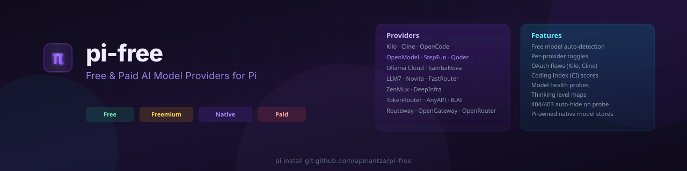

# pi-free-providers

<p align="center">
  
</p>

Free and paid AI model providers for [Pi](https://pi.dev). Access models from multiple providers in one install.

---

## What does pi-free do

**pi-free is a Pi extension that registers additional providers and applies free/all model filters.**

When you install pi-free, it:

1. Registers native providers such as Kilo, Cline, LLM7, FastRouter, Ollama Cloud, OpenModel, and more.
2. Keeps Qoder on its legacy provider surface and supports Pi's built-in OpenCode, OpenCode Go, and OpenRouter integrations.
3. Uses Pi's native model and auth stores for migrated providers; remaining legacy catalogs use their documented cache paths.
4. Applies the global free-only filter by default, while preserving provider-specific paid/trial behavior.
5. Provides per-provider toggle commands — `/toggle-{provider}` switches between the provider's free/basic view and its full catalog.
6. Supports OAuth and API-key authentication where a provider offers them.
7. Adds Coding Index scores to model names and can probe and hide unavailable models.
8. Provides `/pi-free-health` and `/free-startup` diagnostics without exposing credentials.

## Install

```bash
pi install git:github.com/apmantza/pi-free
```

Press `Ctrl+L` to open the model picker. The global free-only setting is enabled by default.

## Quick Start

### Use free models

Cline exposes a public catalog before login. Kilo requires an OAuth credential or API key for authenticated refreshes and chat:

```text
/login cline
/login kilo
```

Qoder remains a legacy provider. Authenticate it with `/login qoder` (PAT or browser OAuth), then use `/toggle-qoder` to switch between its basic free tier and full catalog.

### Toggle between free and paid

```text
/toggle-kilo
/toggle-openrouter
/toggle-free
/free-providers
/pi-free-health
```

### Add API keys (optional)

First run creates `~/.pi/free.json`. Add extension-provider keys there or use the environment variables documented in [Provider catalog & auth](docs/providers.md). For example:

```json
{
  "ollama_api_key": "...",
  "anyapi_api_key": "...",
  "openmodel_api_key": "..."
}
```

## Provider Catalog

| Category | Providers |
| --- | --- |
| Free/free-tier | Kilo, Cline, LLM7, OpenModel, TokenRouter, Qoder basic tier, and eligible models from other catalogs |
| Freemium | AnyAPI, Ollama Cloud, SambaNova |
| Paid/trial | ZenMux, CrofAI, DeepInfra trial, Novita, Routeway, OpenGateway, B.AI, and paid catalog entries from other providers |
| Native | FastRouter |
| Built-in | OpenCode, OpenCode Go, OpenRouter |

Provider availability, authentication, and exact API-key names are maintained in [docs/providers.md](docs/providers.md). pi-free does not publish model counts because provider catalogs change.

### Catalog and credential storage

Migrated native providers use Pi's `~/.pi/agent/models-store.json` and `~/.pi/agent/auth.json`. Remaining legacy network catalogs use `~/.pi/provider-cache.json`; Ollama Cloud uses that cache for capability reuse and its compatibility refresh command. Qoder is intentionally unmigrated and uses its own `~/.pi/agent/qoder-models-cache.json`. `/free-startup` also reports per-provider fetch attempts and post-start session work.

## Docs

| Topic | Link |
| --- | --- |
| Provider catalog & auth | [docs/providers.md](docs/providers.md) |
| Slash commands | [docs/commands.md](docs/commands.md) |
| Configuration & logging | [docs/configuration.md](docs/configuration.md) |
| Features deep dive | [docs/features.md](docs/features.md) |
| Proposed compiled packaging | [docs/build-strategy.md](docs/build-strategy.md) |
| Adding new providers | [CONTRIBUTING.md](CONTRIBUTING.md) |

## License

MIT — See [LICENSE](LICENSE)

**Questions?** [Open an issue](https://github.com/apmantza/pi-free/issues)
